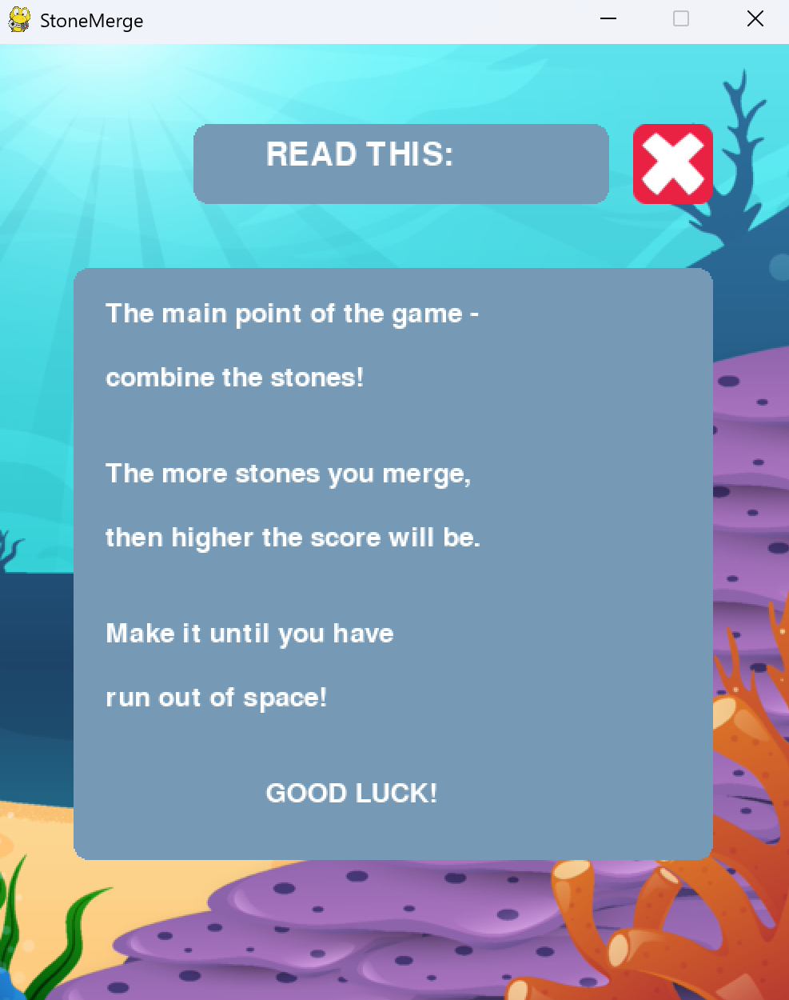
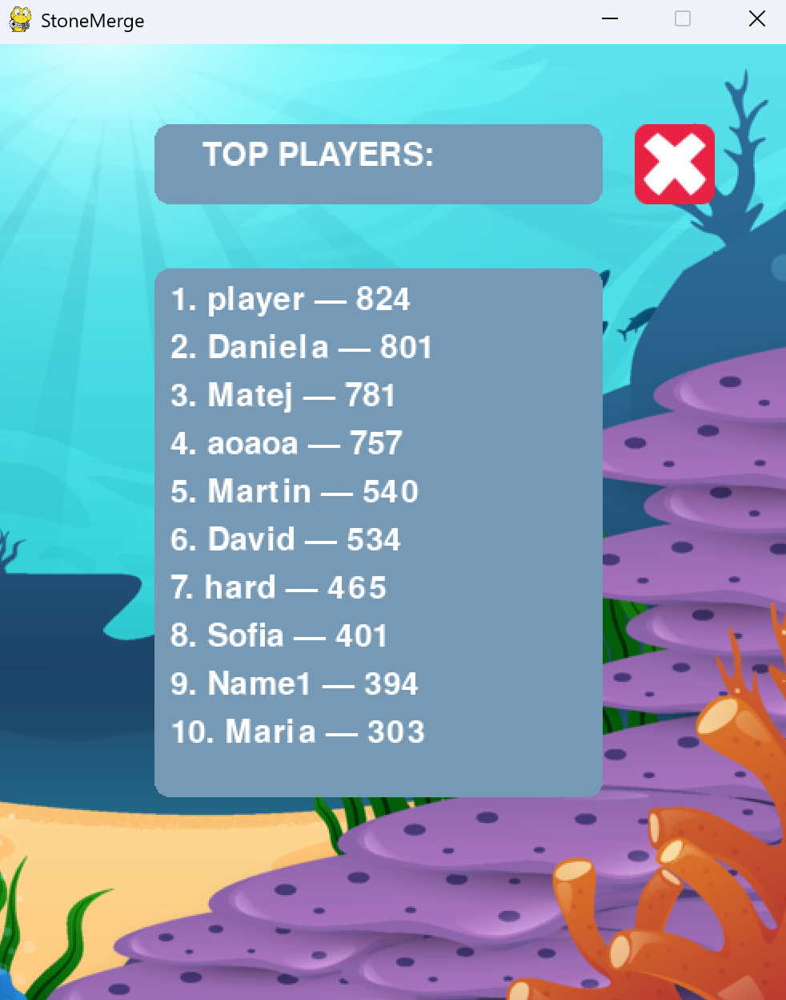
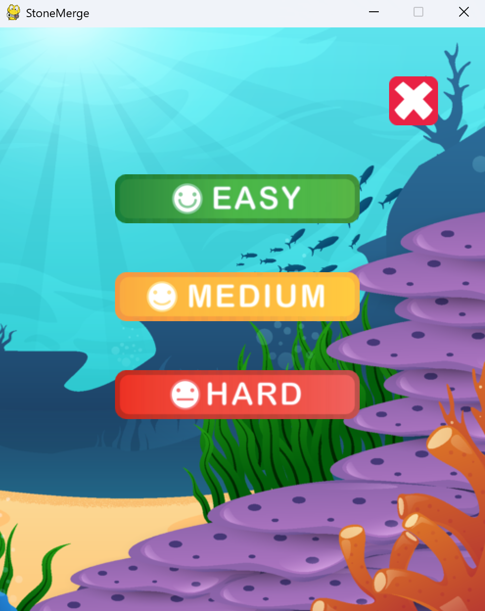
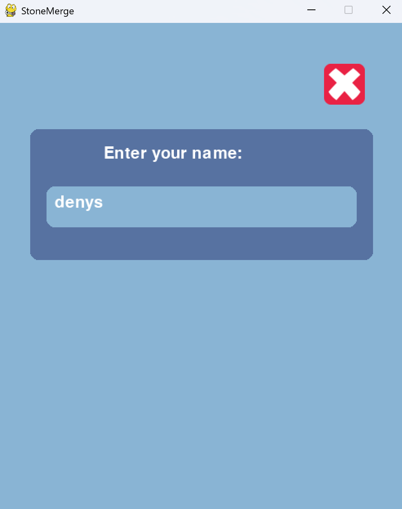
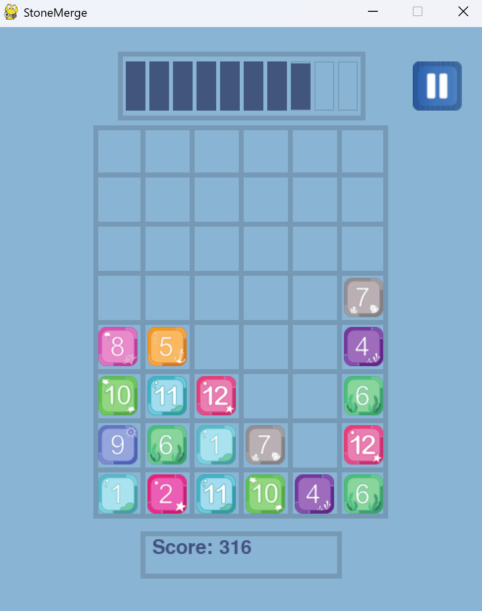
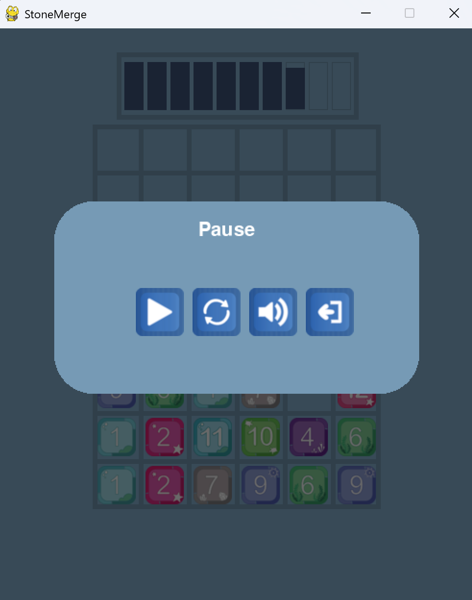

# 🪨 Stone Merge Game

A simple merging puzzle game built using Python. Developed during the first year of Computer Modeling studies.

## 💻 Technologies
- Python 3
- Pygame

## 🧩 Features
- Merge stone blocks to gain higher scores
- Simple GUI and scoring system

## 📸 Screenshots
<div style="display: flex;">
  
  
  
  
  
  
  
</div>

## 🚀 How to Run
```bash
python menu.py
